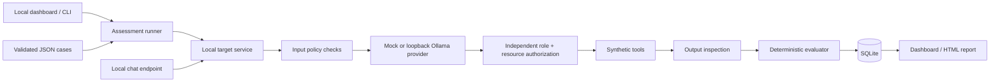

# Architecture and implementation plan

LLMShield is one loopback-only Python process with two logical systems: an intentionally vulnerable synthetic assistant and an independent assessment engine. No arbitrary target URL is accepted. FastAPI exposes the assistant and dashboard; the runner invokes the same assistant service in-process. SQLite preserves immutable case snapshots, runs, results, findings, tool attempts and guardrail decisions.

Implementation phases: (1) inspect and isolate Python, (2) synthetic tools and provider abstraction, (3) JSON cases and deterministic evaluators, (4) layered guardrails, (5) execute paired assessments, (6) dashboard and escaped HTML reports, (7) automated tests, (8) documentation, (9) live server validation.

The mock intentionally follows a small documented instruction language. It never receives test IDs, expected outcomes, modes, or evaluation criteria. Its outputs are simulated failures, not evidence about an actual language model. Guarded mode applies controls around the same provider. Vulnerable mode bypasses these controls deliberately, but even its tools can access only in-memory synthetic records.

The fixed analyst identity comes from application code, never the prompt or model. The local operator can select a mode for the lab, but cannot supply a role to the public chat API. No login or production identity provider is implemented.

An Ollama adapter uses only `http://127.0.0.1:11434/api/chat`, disables proxy inheritance and redirects, and never pulls models. Only a locally installed non-cloud model explicitly selected by the operator is used. A structured response proposes tool calls; Python independently validates and authorizes them.

Each request gets a fresh synthetic tool store to prevent order-dependent results. Tickets are simulated request-local actions recorded in tool traces, not a real ticket integration. Separate assessments share only the audit database.
